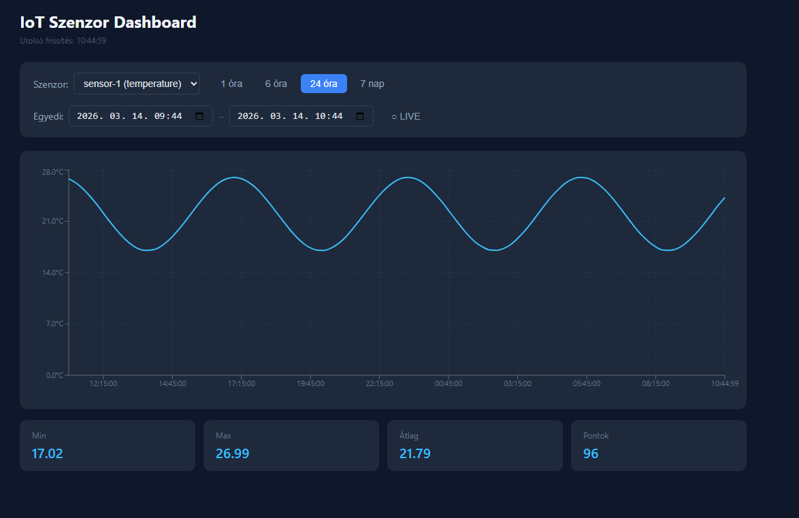

# IoT Szenzor Dashboard

Prototípus IoT szerver rendszer, amely D1 Mini Pro mikrovezérlőkről (BME280 szenzor) fogad hőmérséklet, páratartalom és légnyomás adatokat, eltárolja őket, és egy webes dashboardon vizualizálja.



## Architektúra

```
D1 Mini Pro (BME280)
        │  HTTP POST /api/data
        ▼
   Node.js + Express  ──►  InfluxDB v2
                                │
                           React Frontend
```

- **Backend** – Node.js + Express REST API, fogadja és tárolja a szenzor adatokat
- **Adatbázis** – InfluxDB v2, time-series adatbázis IoT adatokhoz optimalizálva
- **Frontend** – React + Vite + recharts, interaktív dashboard grafikonokkal

## JSON séma (szenzor → szerver)

```json
{
  "sensorId": "sensor-1",
  "sensorType": "temperature",
  "value": 23.5
}
```

Az időbélyeget a szerver generálja a beérkezés pillanatában.

## API végpontok

| Metódus | Útvonal | Leírás |
|---------|---------|--------|
| `POST` | `/api/data` | Szenzor adat fogadás |
| `GET` | `/api/data?sensorId=&from=&to=` | Adatok lekérdezése szűrőkkel |
| `GET` | `/api/sensors` | Elérhető szenzorok listája |

## Indítás

```bash
docker compose up --build
```

A dashboard elérhető: **http://localhost**

### Dummy adatok betöltése (visszamenőleg 24h)

```bash
docker compose exec backend node src/seed.js
```

### Valós idejű szimuláció

```bash
docker compose exec backend node src/seed.js --live
```

## Dashboard funkciók

- Szenzor választó (dropdown)
- Gyors intervallum gombok: 1h / 6h / 24h / 7 nap
- Egyedi dátum–idő tartomány megadása
- **LIVE mód** – csak a kezdőidőt kell beállítani, a végidő mindig az aktuális timestamp
- Min / Max / Átlag / Pontszám statisztika
